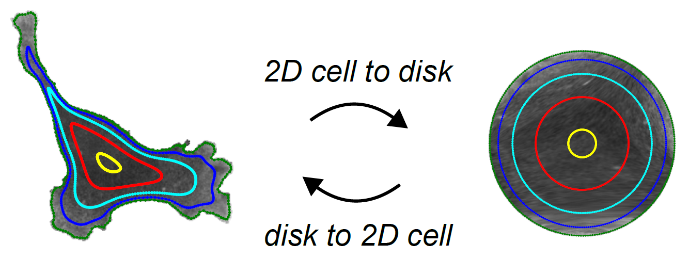

# u-unwrap2D
## Library for 2D Contour-guided computing
<p align="center">
  
</p>

#### August 29, 2024
u-Unwrap2D is a Python library built on top of u-Unwrap3D to map 2D contours and images into canonical representations to facilitate analysis with particular attention to single cell biology.

u-Unwrap2D or u-Unwrap is associated with the manuscript:
[**Mapping Cell Morphology to a Standard Coordinate System for Analyzing Dynamic Cell Signaling**](https://openreview.net/pdf?id=jUmTewPzII), *Imageomics NeurIPS Workshop*, 2025, written by Shiqiu Yu, [Gaudenz Danuser](https://www.danuserlab-utsw.org/), Felix Y. Zhou.

The functions in this library on built on the idealogy of u-Unwrap3D for 2D. For more information please read:
[**Surface-guided computing to quantify dynamic interactions between cell morphology and molecular signals in 3D**](https://doi.org/10.1101/2023.04.12.536640), *bioRxiv*, 2025, written by Felix Y. Zhou, Virangika K. Wimalasena, Qiongjing Zou, Andrew Weems, Gabriel M. Gihana, Edward Jenkins, Bingying Chen, Bo-Jui Chang, Meghan K. Driscoll, Andrew J. Ewald and [Gaudenz Danuser](https://www.danuserlab-utsw.org/).


## Library Features

|Module                   |Functionality|
|-------------------------|-------------|
|unwrap2D       	  | Functions for unwrapping 2D contours and mapping images to disk and square representations. Much recycle/adapt u-Unwrap3D functions.|


## Getting Started
The simplest way to get started is to check out the included notebooks which walks through the steps described in the paper for obtaining all representation starting from step0: the extraction of surface from a binary cell segmentation.

## Dependencies and Installation
You should be able to install the library using `pip`:
```
pip install .
```
Should this fail, the only dependency is u-Unwrap3D, our 3D unwrapping library which can be installed using the command below from PyPI or from its GitHub, https://github.com/DanuserLab/u-unwrap3D. u-Unwrap3D has been tested for Python 3.9-3.12. You can try installing that library first, then perform the above `pip install .`. 
```
pip install u-Unwrap3D
```

## Questions and Issues
Feel free to open a GitHub issue, and we will get back as soon as we can.

## Developers
Felix Zhou (felixzhou1@gmail.com)
Shiqiu Yu (Shiqiu.Yu2@UTSouthwestern.edu)

## Danuser Lab Links
[Danuser Lab Website](https://www.danuserlab-utsw.org/)

[Software Links](https://github.com/DanuserLab/)
