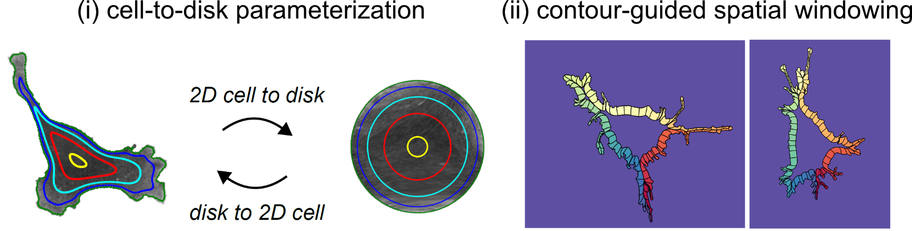

# u-Unwrap2D
## Library for 2D Contour-guided computing and Shape parameterization
<p align="center">
  
</p>

<!-- TOC start -->
   * [Library Features](#library-features)
   * [Getting Started](#getting-started)
   * [Dependencies and Installation](#dependencies-and-installation)
      + [PyPI Installation](#pypi-installation)
      + [Manual Installation](#manual-installation)
   * [Questions and Issues](#questions-and-issues)
   * [Developers](#developers)
   * [Danuser Lab Links](#danuser-lab-links)
<!-- TOC end -->

[](https://badge.fury.io/py/u-Unwrap)
[](https://pepy.tech/project/u-Unwrap)
[](https://pepy.tech/project/u-Unwrap)
[](https://pypistats.org/packages/u-Unwrap)
[](https://github.com/DanuserLab/u-unwrap/)
[](https://github.com/DanuserLab/u-unwrap/)
[](https://github.com/DanuserLab/u-unwrap/blob/master/LICENSE)

#### :star2: Apr 2026 :star2:
- u-Unwrap is available in PyPI and can be directly installed with `pip install u-Unwrap`

#### August 29, 2024
u-Unwrap2D is a Python library built on top of u-Unwrap3D to enable mapping of 2D contours and 2D shapes into canonical representations for registration and windowing to facilitate downstream analysis with particular attention to single cell biology.

The **disk parameterization** of u-Unwrap2D or u-Unwrap is described in the following manuscript, particularly with respect to spatiotemporal analysis of single cell morphodynamics:
[**Mapping Cell Morphology to a Standard Coordinate System for Analyzing Dynamic Cell Signaling**](https://openreview.net/pdf?id=jUmTewPzII), *Imageomics NeurIPS Workshop*, 2025, written by Shiqiu Yu, [Gaudenz Danuser](https://www.danuserlab-utsw.org/), Felix Y. Zhou.

The **contour-guided spatial windowing** is briefly described in the following manuscript, and used to compare edge-based molecular signaling patterns across experimental conditions:
[**Caveolin-1 regulates context-dependent signaling and survival in Ewing sarcoma**](https://www.biorxiv.org/content/10.1101/2024.09.23.614468v4), *bioRxiv*, 2025, written by Dagan Segal, Xiaoyu Wang, Hanieh Mazloom-Farisbaf, Felix Y. Zhou, Divya Rajendran, Erin Butler, Bingying Chen, Bo-Jui Chang, Khushi Ahuja, Averi Perny, Kushal Bhatt, Dana Kim Reed, Diego H. Castrillon, Jeon Lee, Elise Jeffery, Lei Wang, Khai Nguyen, Noelle S. Williams, Stephen X. Skapek, Satwik Rajaram, Reto Fiolka, Khuloud Jaqaman, Gary Hon, James F. Amatruda, [Gaudenz Danuser](https://www.danuserlab-utsw.org/).

The functions in this library on built on the idealogy of u-Unwrap3D for 2D. For more information please read:
[**Surface-guided computing to quantify dynamic interactions between cell morphology and molecular signals in 3D**](https://doi.org/10.1101/2023.04.12.536640), *bioRxiv*, 2025, written by Felix Y. Zhou, Virangika K. Wimalasena, Qiongjing Zou, Andrew Weems, Gabriel M. Gihana, Edward Jenkins, Bingying Chen, Bo-Jui Chang, Meghan K. Driscoll, Andrew J. Ewald and [Gaudenz Danuser](https://www.danuserlab-utsw.org/).


## Library Features
u-Unwrap2D exposes differential geometric and image processing functions to primarily enable two core functionalities depicted in the banner image:

1. **Disk Parameterization of Cell Shape**: The entire cell shape is mapped to a disk. As this involves metric distortion. u-Unwrap implements conformal mapping, equiareal mapping through a robust density-based relaxation scheme, and (in development), equidistant mapping based on redistributing vertices of the equiareal map.   
2. **Contour-Guided Spatial Windowing**: The cell contour is propagated using conformalized mean curvature flow implemented in an active contours scheme that allows additional regularization by gradient of a harmonic Poisson distance transform. This implementation as depicted allows flexible handling of highly complex, high-curvature cell geometries inaccessible by conventional methods. Compared to disk parameterization, contour-guided spatial windowing allows more equidistant propagation into the cell area, and is much more efficient to run for edge-centric analyses.   

_Additionally_: 
- **An optimized diffeomorphic and gradient vector flow algorithm** for consistent cell boundary tracking of highly morphodynamic shapes, (see `tutorial/example1_unwrap2Dpipeline.ipynb`)


The library functions are provided through one module, which can be accessed by `import unwrap2D.unwrap2D` after installation.
|Module                   |Functionality|
|-------------------------|-------------|
|unwrap2D       	  | Functions for unwrapping 2D contours and mapping images to disk and square representations. Much recycle/adapt u-Unwrap3D functions.|


## Getting Started
The simplest way to get started is to check out the included notebooks in the `tutorials/` folder of this GitHub which guides users using example data in the `example_data/` folder through key steps of our [NeurIPS 2025 Workshop](https://openreview.net/forum?id=jUmTewPzII) paper for using u-Unwrap to perform consistent spatiotemporal windowing of a highly dynamic neutrophil cell.  

1. **example1_unwrap2Dpipeline.ipynb**: This notebook demonstrates the spatiotemporal analysis pipeline involving consistent edge boundary tracking and disk parameterization of each timepoint.
2. **example2_windowing_analysis.ipynb**: This notebook is an example of spatial windowing on the disk parameterization and subsequent further analysis, including sampling the activity matrix (remapping signal activities), and visualization of the windows mapped back to the original cell shape.


## Dependencies and Installation

### PyPI Installation
u-Unwrap is available in PyPI. Install using `pip`:
```
pip install u-Unwrap
```

### Manual Installation
You should be able to install the library using `pip`:
```
pip install .
```
Should this fail, the only dependency is u-Unwrap3D, our 3D unwrapping library which can be installed using the command below from PyPI or from its GitHub, https://github.com/DanuserLab/u-unwrap3D. u-Unwrap3D has been tested for Python 3.9-3.12. You can try installing that library first, then perform the above `pip install .`. 
```
pip install u-Unwrap3D
```

## Questions and Issues
Feel free to open a GitHub issue, and we will get back as soon as we can.

## Developers
Felix Zhou (felixzhou1@gmail.com)

Shiqiu Yu (Shiqiu.Yu2@UTSouthwestern.edu)

## Danuser Lab Links
[Danuser Lab Website](https://www.danuserlab-utsw.org/)

[Software Links](https://github.com/DanuserLab/)